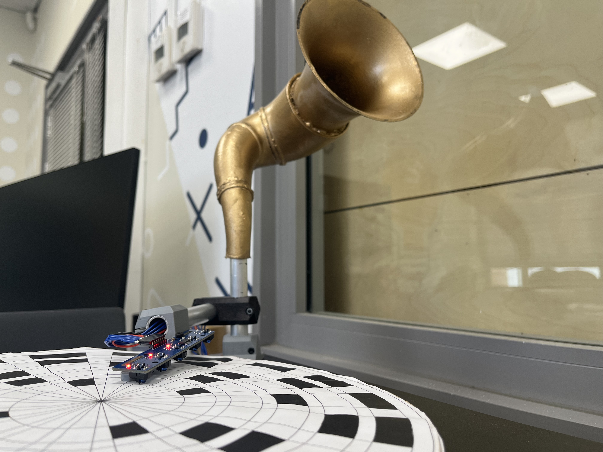

## Paper Sequencer Project by Adan Suleiman, Yazan Daoud and Nashwa Jaber:  

Paper Sequencer is an auditory device designed to emit a distinctive sound upon detecting a black square within any of its five discs.

Our user can: 

- Upload new sound files via a webpage or simply enjoy our pre-downloaded default sounds!

- Start and stop the system: click to start and click to stop the disks from spinning!

- Control the volume: move a button left and right to raise and reduce the volume!

## Features list:

## Wiring diagram and pins:

## Our webpage:
The user can upload an audio file for each of the five disks.

## Physical model:

## Folder description :
 You can find the following files:
- **Servo_with_click_arduino.ino:**
  An Arduino code that runs servo in a constant speed and a button can be attached.
- **Audio_and_sensor_simple_test.ino:**
  A test that takes an audio file from an SD and releases it once the sensor encounters a black square.
- **Audio_with_SD_simple_test.ino:**
  A test that takes an audio file from an SD and starts playing it.
- **final_code.ino:**
  Our project's main code.
- **user_interface.html:**
  Our user interface webpage.
- **http_handling.ino:**
  using esp32 as an access point.

## Arduino/ESP libraries installed for the project:
* ESP32Servo.h
* SD.h
* I2Saudio.h
* WiFi.h
* WebServer.h
* ESPAsyncWebServer.h

## Project Poster:
 
This project is part of ICST - The Interdisciplinary Center for Smart Technologies, Taub Faculty of Computer Science, Technion
https://icst.cs.technion.ac.il/

